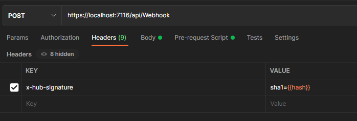
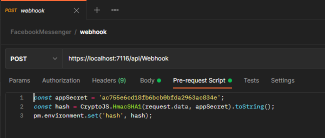

Aplicação de exemplo de como validar o `x-hub-signature` enviado nas requisições do webhook da plataforma do Messenger do Facebook, conforme a documentação https://developers.facebook.com/docs/messenger-platform/webhook. 

## Como executar a aplicação

Importar a [collection](docs\FacebookMessenger.postman_collection.json) no postman.

No `POST webhook` é adicionado o `x-hub-signature` atráves da variável de ambiente `{{hash}}`.

A variável `{{hash}}` é preenchida no `Pre-request Script` da request `POST webhook`.

O `appSecret` passado no `HmacSHA1` do `Pre-request Script` deverá ser o mesmo configurado na constante `appSecret` na classe [VerificarAssinaturaMiddleware.cs](FacebookMessenger\Middlewares\VerificarAssinaturaMiddleware.cs)

O endpoint `POST /api/Webhook` retornará 403 caso o valor `x-hub-signature` não for válido.
